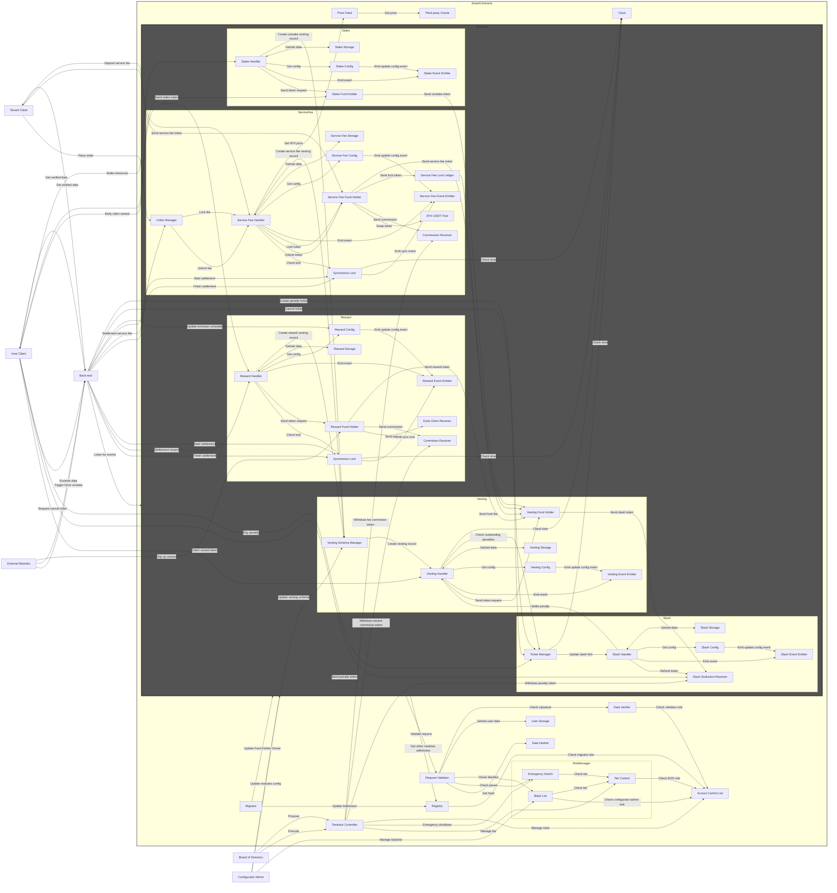

# System Components

```mermaid
flowchart LR
    classDef lighter fill:#535353,stroke:#333,stroke-width:4px;

    DA[Board of Directors]
    CA[Configurator Admin]
    H[Host Client]
    T[Tenant Client]
    EX[External Modules]
    BE[Back-end]

    DA -->|Propose| TL
    DA -->|Execute| TL

    EX -->|Top-up reward| RWF
    EX -->|Runtime data| BE
    EX -->|Trigger force unstake| BE
    
    CA -->|Manage blacklist| BL
    CA -->|Update modules config| Modules
    CA -->|Update vesting schema| VTS

    H <-->|Get verified data| BE
    H -->|Stake resources| STH
    H -->|Send stake token| STF
    H -->|Early claim reward| RWH
    H -->|Pay penalty| SLT
    H -->|Request cancel ticket| BE
    H -->|Send penalty token| SLF
    H -->|Claim vested token| VTH

    T <-->|Get verified data| BE
    T -->|Deposit service fee| SFH
    T -->|Send service fee token| SFF
    T -->|Place order| SFO

    BE -->|Listen for events| Modules
    BE -->|Create penalty ticket| SLT
    BE -->|Cancel ticket| SLT
    BE -->|Update emission schedule| RWC

    BE -->|Start settlement| SFS
    BE -->|Settlement service fee| SFO
    BE -->|Finish settlement| SFS

    BE -->|Start settlement| RWS
    BE -->|Settlement reward| RWH
    BE -->|Finish settlement| RWS

    subgraph SmartContracts
        style SmartContracts stroke:#333,stroke-width:2px;
        
        TL[Timelock Controller]
        MI[Migrator]
        RG[Registry]
        RV[Request Validator]
        DH[Data Hasher]
        UD[User Storage]
        DV[Data Verifier]
        AC[Access Control List]

        TL -->|Manage roles| AC
        TL -->|Emergency shutdown| ES
        TL -->|Manage tier| TC
        TL -->|Withdraw penalty token| SLF
        TL -->|Withdraw fee commision token| SFR
        TL -->|Withdraw reward commision token| RWR

        Oracle[Third-party Oracle]
        PF[Price Feed]
        Clock[Clock]

        subgraph RiskManager
            ES[Emergency Switch]
            TC[Tier Control]
            BL[Black List]

            ES -->|Check tier| TC
            BL -->|Check tier| TC
        end

        BL -->|Check configurator admin role| AC
        TC -->|Check BOD role| AC
        
        Modules -->|Validate request| RV
        RV -->|Check signature| DV
        RV -->|Get/set user data| UD
        DV -->|Check validator role| AC
        RV -->|Check blacklist| BL
        RV -->|Check pause| ES
        RV -->|Get hash| DH

        Modules -->|Get other modules addresses| RG

        RG -->|Check migrator role| AC

        MI -->|Update Addresses| RG
        MI -->|Update Fund Holder Owner| Modules
        SFH -->|Get ATH price| PF
        PF -->|Get price| Oracle

        SFS -->|Check time| Clock
        RWS -->|Check time| Clock
        VTH -->|Check time| Clock
        SLT -->|Check time| Clock
        VTH -->|Check outstanding penalties| SLT

        subgraph Modules
            direction LR
            class Modules lighter

            STF -->|Send unstake token| VTF
            STH -->|Create unstake vesting record| VTS

            SFF -->|Send service fee token| VTF
            SFH -->|Create service fee vesting record| VTS

            RWF -->|Send reward token| VTF
            RWH -->|Create reward vesting record| VTS

            SLH -->|Settle penalty| VTH
            VTF -->|Send slash token| SLF
            SFL -->|Send host fee| VTF

            subgraph ServiceFee
                SFH[Service Fee Handler]
                SFD[Service Fee Storage]
                SFO[Order Manager]
                SFC[Service Fee Config]
                SFF[Service Fee Fund Holder]
                SFE[Service Fee Event Emitter]
                SFR[Commission Receiver]
                SFL[Service Fee Lock Ledger]
                SFS[Synchonize Lock]
                SFP[ATH-USDT Pool]

                SFH <-->|Get/set data| SFD
                SFH -->|Get config| SFC
                SFH -->|Emit event| SFE
                SFC -->|Emit update config event| SFE
                SFO -->|Lock fee| SFH
                SFH -->|Lock token| SFF
                SFO -->|Unlock fee| SFH
                SFH -->|Unlock token| SFF
                SFF -->|Send lock token| SFL
                SFF -->|Send commission| SFR
                SFH -->|Check lock| SFS
                SFS -->|Emit sync event| SFE
                SFF -->|Swap token| SFP
            end

            subgraph Stake
                STH[Stake Handler]
                STD[Stake Storage]
                STC[Stake Config]
                STF[Stake Fund Holder]
                STE[Stake Event Emitter]

                STH <-->|Get/set data| STD
                STH -->|Get config| STC
                STH -->|Emit event| STE
                STH -->|Send token request| STF
                STC -->|Emit update config event| STE
            end
            
            subgraph Reward
                RWH[Reward Handler]
                RWD[Reward Storage]
                RWC[Reward Config]
                RWF[Reward Fund Holder]
                RWE[Reward Event Emitter]
                RWR[Commision Receiver]
                RWS[Synchonize Lock]
                RWP[Early Claim Receiver]
    
                RWH <-->|Get/set data| RWD
                RWH -->|Get config| RWC
                RWH -->|Emit event| RWE
                RWH -->|Send token request| RWF
                RWC -->|Emit update config event| RWE
                RWF -->|Send commission| RWR
                RWF -->|Send penalty| RWP
                RWH -->|Check lock| RWS
                RWS -->|Emit sync lock| RWE
            end

            subgraph Slash
                SLH[Slash Handler]
                SLD[Slash Storage]
                SLT[Ticket Manager]
                SLC[Slash Config]
                SLF[Slash Deduction Receiver]
                SLE[Slash Event Emitter]

                SLT -->|Update slash info| SLH
                SLH <-->|Get/set data| SLD
                SLH -->|Get config| SLC
                SLH -->|Emit event| SLE
                SLC -->|Emit update config event| SLE
                SLH -->|Refund token| SLF
            end

            subgraph Vesting
                VTH[Vesting Handler]
                VTD[Vesting Storage]
                VTC[Vesting Config]
                VTF[Vesting Fund Holder]
                VTE[Vesting Event Emitter]
                VTS[Vesting Schema Manager]

                VTH <-->|Get/set data| VTD
                VTH -->|Get config| VTC
                VTH -->|Emit event| VTE
                VTH -->|Send token request| VTF
                VTC -->|Emit update config event| VTE
                VTS -->|Create vesting record| VTH
            end
        end
    end
```