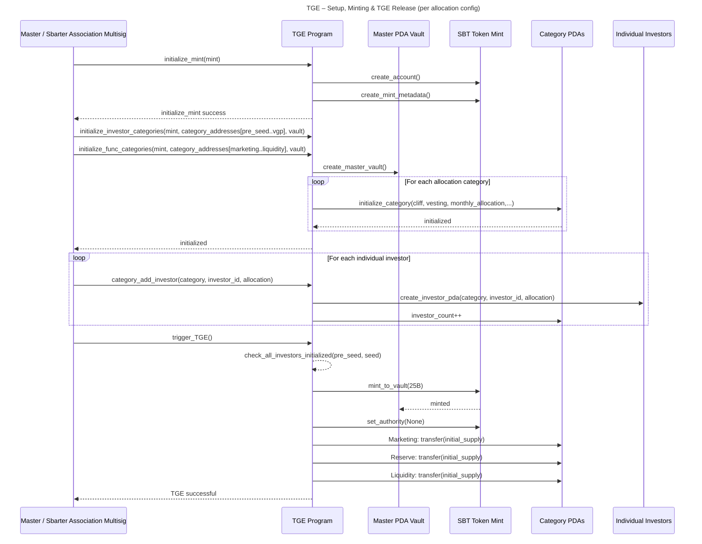
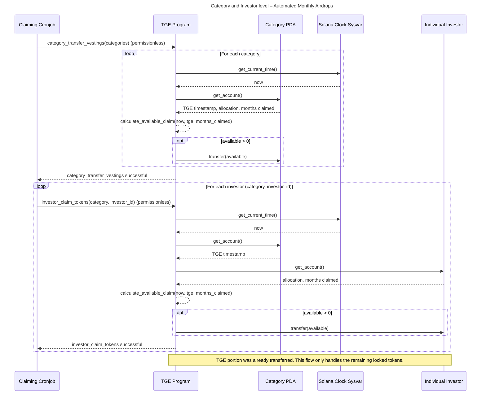
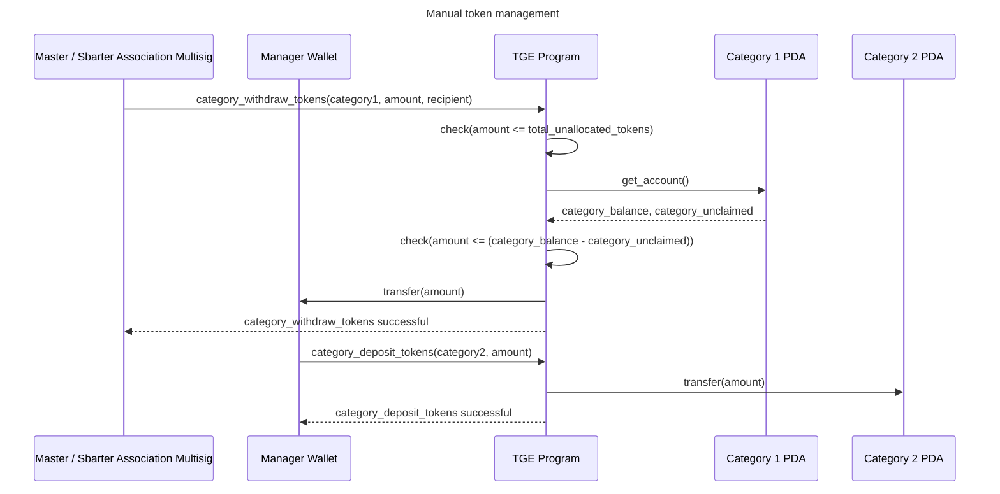

# Sbarter Token Program

The Solana program responsible for TGE and distribution of SBT tokens to categories
and investors according to the cliff & vesting schedule.

Category PDAs are created on initialization, then investors are added
one-by-one, and the TGE instruction is triggered. All of the above are signed
by the Sbarter Multisig Wallet.

The program also exposes two permissionless instructions:
`category_transfer_vestings` and `investor_claim_tokens`, that can be run
manually by anybody incentivized or by the first-party Automation Cronjob.

## How to test

1. Build the program:

```bash
anchor build -- --features local-testing
```

2. Run solana-test-validator:

```bash
solana-test-validator -r \
    --bpf-program 5LnwuNSM9TKgr69YXoLCdCdoZ7SZ1kvtYAdknPGSJ3KX target/sbpf-solana-solana/release/master_token_program.so \
    --clone TokenzQdBNbLqP5VEhdkAS6EPFLC1PHnBqCXEpPxuEb \
    --clone ATokenGPvbdGVxr1b2hvZbsiqW5xWH25efTNsLJA8knL \
    --url devnet
```

3. Run tests:

```bash
anchor test --skip-local-validator --skip-deploy -- --features local-testing
```

(`anchor test` normally loads programs automagically, but it never ever works
for me.)

- You will need a keypair at `~/.config/solana/id.json` to run it.
  It will be used as an example master authority, instead of the Multisig.
- Also consider replacing the public RPC URL with a dedicated one.

## Key flow sequences

1. Initial setup and TGE



2. Token claims



3. Manual token management


